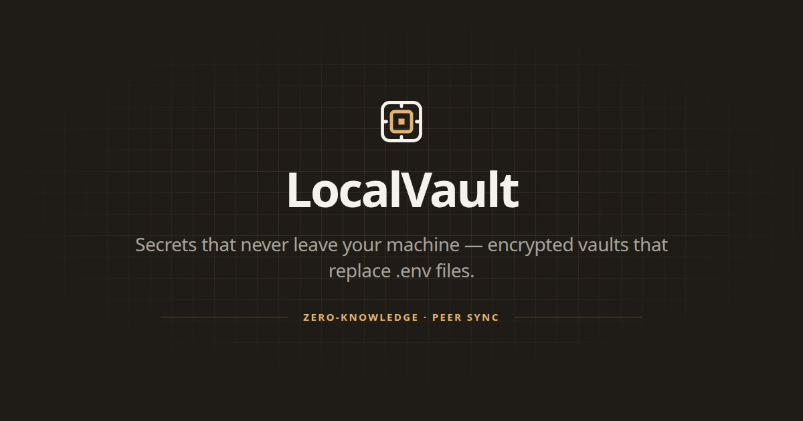

<p align="center">
  
</p>

<p align="center">
  <strong>Encrypted secret sync for dev teams.</strong><br/>
  Zero-knowledge · Peer sync · Replaces <code>.env</code> files
</p>

<p align="center">
  <a href="https://github.com/zain-23/local-vault/releases/latest"></a>
  <a href="LICENSE"></a>
  <a href="https://github.com/zain-23/local-vault/releases"></a>
</p>

---

## Install

Prebuilt `lv` binaries ship on every [GitHub Release](https://github.com/zain-23/local-vault/releases/latest) for Linux, macOS, and Windows.

### Linux / macOS

Pick the archive for your platform, extract `lv`, and put it on your `PATH`:

| Platform | Archive |
| -------- | ------- |
| Linux x86_64 | [`lv_linux_amd64.tar.gz`](https://github.com/zain-23/local-vault/releases/latest/download/lv_linux_amd64.tar.gz) |
| Linux ARM64 | [`lv_linux_arm64.tar.gz`](https://github.com/zain-23/local-vault/releases/latest/download/lv_linux_arm64.tar.gz) |
| macOS Intel | [`lv_darwin_amd64.tar.gz`](https://github.com/zain-23/local-vault/releases/latest/download/lv_darwin_amd64.tar.gz) |
| macOS Apple Silicon | [`lv_darwin_arm64.tar.gz`](https://github.com/zain-23/local-vault/releases/latest/download/lv_darwin_arm64.tar.gz) |

```bash
# Example: Linux amd64
curl -fsSL https://github.com/zain-23/local-vault/releases/latest/download/lv_linux_amd64.tar.gz \
  | tar -xzf - lv
sudo mv lv /usr/local/bin/lv
lv --help
```

```bash
# Example: macOS Apple Silicon
curl -fsSL https://github.com/zain-23/local-vault/releases/latest/download/lv_darwin_arm64.tar.gz \
  | tar -xzf - lv
sudo mv lv /usr/local/bin/lv
lv --help
```

### Windows

1. Download [`lv_windows_amd64.zip`](https://github.com/zain-23/local-vault/releases/latest/download/lv_windows_amd64.zip) (or `lv_windows_arm64.zip`).
2. Unzip and add `lv.exe` to your `PATH`.
3. Open a new terminal and run `lv --help`.

### With Go

Requires Go 1.26+. Installs as `local-vault` — rename it to `lv`:

```bash
go install github.com/zain-23/local-vault@latest
mv "$(go env GOPATH)/bin/local-vault" "$(go env GOPATH)/bin/lv"
# ensure $(go env GOPATH)/bin is on your PATH
lv --help
```

### From source

```bash
git clone https://github.com/zain-23/local-vault
cd local-vault
go build -o lv .
# or: go build -o lv ./apps/cli
# or: task cli:build
sudo mv lv /usr/local/bin/lv
```

> Release binaries default to the hosted API. Point `lv` at another server with:
> `export SERVER_URL=https://your-server`

---

## Quick start

```bash
# Sign in (device login in the browser)
lv login

# Create a vault in your project
cd my-project
lv init
lv unlock

# Add secrets
lv add DATABASE_URL=postgres://localhost/mydb
lv add API_KEY=sk-live-xxx
lv add STRIPE_KEY=sk_live_xxx --env production

# Run your app with secrets injected
lv inject -- npm run dev

# Import an existing .env
lv import .env.local
```

---

## Session management

Unlock once; then commands run without re-prompting (like an SSH agent).

```bash
lv unlock          # unlock for ~12 hours
lv list            # no passphrase prompt
lv lock            # lock this project
lv lock --all      # lock every project
```

Each project has its own session. Unlocking one never unlocks another.

---

## Team sync

```bash
# ── Owner ──────────────────────────────────────────
lv invite teammate@company.com
# invite email sent with join code

lv push
# encrypted snapshot sent to peers


# ── Teammate ───────────────────────────────────────
lv login
lv join ABCD-1234
lv sync
lv inject -- npm run dev
```

Peers can be anywhere — offices, cities, networks. Offline teammates get queued messages (held briefly) and receive them when they come online.

```bash
lv invite --list                 # pending invites & collaborators
lv invite --revoke sara@co.com   # revoke a pending invite
lv peers                         # who has vault access
lv revoke <device-id>            # remove a peer
lv rotate --all                  # rotate after a revoke
```

---

## Secret rotation

```bash
lv rotate API_KEY
lv rotate API_KEY STRIPE_KEY DATABASE_URL
lv rotate --all
lv rotate --all --env production
```

---

## Security

```
Passphrase → Argon2id → AES-256-GCM → vault.json.enc
X25519 ECDH → shared secret → AES-256-GCM → encrypted blob
```

| Layer | Algorithm |
| ----- | --------- |
| Vault encryption | AES-256-GCM |
| Key derivation | Argon2id |
| Peer key exchange | X25519 ECDH |
| Device identity | Ed25519 |
| Session cache | OS keychain |

**The signaling server sees:** encrypted blobs, device IDs, and IPs for discovery.

**Never leaves your machine in plaintext:** secrets, passphrase, private keys.

---

## Commands

| Command | Description |
| ------- | ----------- |
| `lv login` / `lv logout` | Device auth session |
| `lv whoami` | Show signed-in identity |
| `lv init` | Create encrypted vault |
| `lv unlock` / `lv lock` | Session unlock / lock |
| `lv add KEY=VALUE` | Add or update a secret |
| `lv get KEY` | Print a secret value |
| `lv list` | List secrets |
| `lv remove KEY` | Delete a secret |
| `lv import FILE` | Import from `.env` |
| `lv inject -- CMD` | Run a command with secrets |
| `lv invite EMAIL` | Email invite with join code |
| `lv join CODE` | Join with invite code |
| `lv push` / `lv sync` | Push / pull encrypted snapshot |
| `lv peers` | List trusted peers |
| `lv revoke DEVICE_ID` | Remove peer access |
| `lv rotate KEY` | Rotate secret(s) |
| `lv status` | Vault health |
| `lv log` | Local audit trail |

Flags like `--env production` work on add, list, inject, rotate, and import.

---

## Next.js

```bash
lv import .env.local --env development
lv import .env.production --env production
```

```json
{
  "scripts": {
    "dev": "lv inject --env development -- next dev",
    "build": "lv inject --env production -- next build",
    "start": "lv inject --env production -- next start"
  }
}
```

App code stays the same — `process.env.KEY` works as usual.

---

## Monorepo development

```text
apps/cli      Go CLI (lv)
apps/server   Go API + email worker
apps/web      React web app
packages/     Shared TypeScript packages
```

```bash
pnpm install
pnpm dev              # web
pnpm build
pnpm lint / test

task cli:build
task server:run
task test:go
```

Requires [pnpm](https://pnpm.io), [Go](https://go.dev), and optionally [Task](https://taskfile.dev).

---

## What gets committed

| Path | Commit? |
| ---- | ------- |
| `.lv/identity.pub` | Yes — safe |
| `.lv/vault.json.enc` | No — gitignored |
| `.lv/identity.key` | No — gitignored |
| `.lv/identity.json` | No — gitignored |

---

<p align="center">
  <em>Stop sharing secrets over Slack.</em><br/><br/>
  <a href="https://github.com/zain-23/local-vault/issues">Report a bug</a>
  ·
  <a href="https://github.com/zain-23/local-vault/issues">Request a feature</a>
  ·
  <a href="https://github.com/zain-23/local-vault/releases/latest">Download latest</a>
</p>
